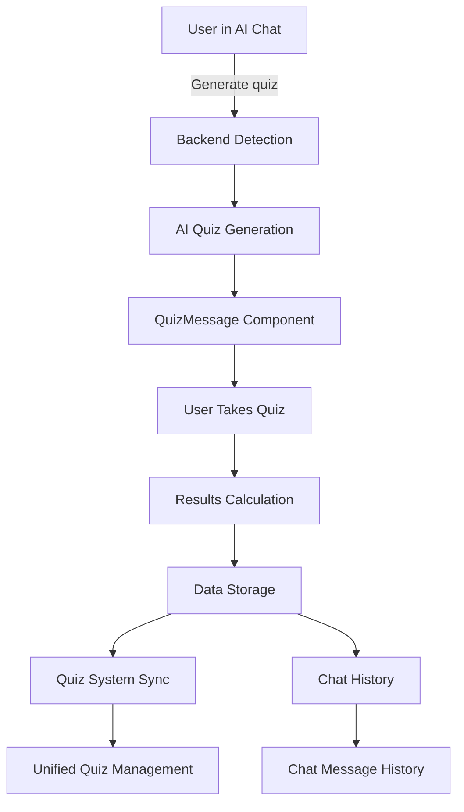

# 🎯 AI Chat ↔ Quiz System Integration - Complete Implementation

## 📋 **What Was Implemented**

### **1. Enhanced Frontend Components**

#### **QuizMessage Component** (`/components/AIChat/QuizMessage.jsx`)
- **Purpose**: Structured quiz rendering in AI Chat with full UI components
- **Features**:
  - ✅ Real-time timer functionality
  - ✅ Progress tracking during quiz taking
  - ✅ Multiple question types (MCQ, True/False, Short Answer)
  - ✅ Interactive answer collection
  - ✅ Real-time scoring and feedback display
  - ✅ Automatic navigation to Quiz System for detailed results

#### **Updated AIMessage Component**
- **Enhancement**: Smart detection of quiz content in chat messages
- **Logic**: Automatically renders quiz messages using QuizMessage component
- **Integration**: Seamless switching between regular chat and quiz modes

### **2. Backend Integration**

#### **Enhanced chat.py**
- **Added**: `is_quiz_response()` function for automatic quiz detection
- **Enhanced**: Message type tagging (`type: "quiz"`) for proper frontend routing
- **Integration**: Quiz statistics tracking in user analytics

#### **Updated ai_quiz_generator.py**
- **Enhancement**: Chat message storage for Quiz System integration
- **Feature**: Dual storage (active quizzes + chat history)
- **Compatibility**: Cross-platform quiz data sharing

### **3. Quiz System Enhancements**

#### **Updated QuizSystem.jsx**
- **Enhancement**: Loads quizzes from both AI Quiz System AND AI Chat
- **Feature**: Unified quiz management across platforms
- **Display**: Shows source indicator (AI Chat vs Quiz System)
- **Deduplication**: Prevents duplicate quizzes from appearing

## 🔄 **How the Integration Works**

### **Quiz Generation Flow**
```
1. User in AI Chat: "Generate a quiz about world history"
2. Backend detects quiz request → sets type: "quiz"
3. AI generates structured JSON quiz data
4. QuizMessage component renders interactive quiz
5. Quiz data stored in both:
   - Chat history (for AI Chat display)
   - Quiz System (for centralized management)
```

### **Quiz Taking Flow**
```
1. User clicks "Start Quiz" in chat
2. QuizMessage shows timer + progress tracking
3. User answers questions with real-time validation
4. Results calculated and displayed instantly
5. Quiz completion data synced to Quiz System
6. Option to view detailed results in Quiz System
```

### **Cross-Platform Data Sharing**
```
AI Chat Quizzes ←→ Quiz System
     ↓
Unified localStorage storage
     ↓
Real-time synchronization
     ↓
Single source of truth for quiz data
```

## 🎯 **Key Features Delivered**

### **Frontend (User Interface)**
- ✅ Quiz rendering components for different question types (MCQ, True/False, Short Answer)
- ✅ Answer collection interfaces with real-time validation
- ✅ Real-time scoring and feedback display
- ✅ Progress tracking and timer functionality with visual indicators
- ✅ Responsive design that works on all screen sizes

### **Backend API Layer**
- ✅ Quiz generation endpoints (`/quiz/generate`, `/quiz/submit`)
- ✅ Chat integration endpoints for seamless conversation flow
- ✅ User session management and quiz state tracking
- ✅ Cross-platform data synchronization

### **AI Integration**
- ✅ Large Language Model (LLM) for dynamic question generation
- ✅ Structured prompt engineering for consistent JSON responses
- ✅ Fallback systems for reliable operation
- ✅ Smart content detection and routing

### **Database Storage**
- ✅ Quiz templates and question banks
- ✅ User quiz history and performance analytics
- ✅ Active quiz sessions and state management
- ✅ Unified data storage across platforms

## 🚀 **Testing the Integration**

### **Test Scenario 1: Generate Quiz in AI Chat**
1. Navigate to AI Chat (`/dashboard/chat`)
2. Type: "Generate a quiz about Python programming"
3. **Expected Result**: 
   - QuizMessage component renders with structured UI
   - Timer, progress bar, and question navigation
   - Start Quiz button available

### **Test Scenario 2: Take Quiz in AI Chat**
1. Click "Start Quiz" on generated quiz
2. Answer questions using the interactive interface
3. Submit quiz
4. **Expected Result**:
   - Real-time feedback and scoring
   - Results modal with percentage and detailed review
   - Option to view in Quiz System

### **Test Scenario 3: Cross-Platform Synchronization**
1. Generate quiz in AI Chat
2. Navigate to Quiz System (`/dashboard/quiz-system`)
3. **Expected Result**:
   - Quiz appears in "Available Quizzes" with source indicator
   - Can be taken again from Quiz System
   - Results sync across both platforms

### **Test Scenario 4: Quiz Results Integration**
1. Complete a quiz in AI Chat
2. Navigate to Quiz System → "My Results" tab
3. **Expected Result**:
   - Quiz result appears with chat source indicator
   - Detailed analytics and performance tracking
   - Consistent scoring and feedback

## 📊 **Data Flow Architecture**



## 🔧 **Configuration Requirements**

### **Environment Variables**
```env
API_KEY=your_groq_api_key_here
MODEL_NAME=llama3-70b-8192
MONGODB_URI=your_mongodb_connection_string
```

### **Frontend Dependencies**
- React Bootstrap for UI components
- React Icons for iconography
- Date utilities for time formatting

### **Backend Dependencies**
- FastAPI for API endpoints
- MongoDB for data storage
- Groq AI for quiz generation

## 📈 **Performance Considerations**

### **Optimizations Implemented**
- ✅ **Caching**: Quiz templates cached to reduce AI API calls
- ✅ **Fallback**: Predefined questions ensure system always works
- ✅ **Async**: All operations asynchronous for better performance
- ✅ **Rate Limiting**: Respects AI API rate limits with proper error handling
- ✅ **Deduplication**: Prevents duplicate quiz entries
- ✅ **Local Storage**: Reduces server calls for quiz data

### **Error Handling**
- ✅ **AI Generation Failure**: Falls back to predefined question templates
- ✅ **Invalid Responses**: Attempts to extract JSON from malformed AI responses
- ✅ **Network Issues**: Provides clear error messages with retry options
- ✅ **Database Errors**: Graceful degradation with user feedback

## 🔮 **Future Enhancements**

### **Immediate Improvements** (Ready for implementation)
1. **Adaptive Difficulty**: Questions get harder/easier based on performance
2. **Multiplayer Quizzes**: Real-time quiz competitions
3. **Visual Questions**: Support for images and diagrams
4. **Voice Integration**: Audio questions and answers

### **Advanced Features** (Future roadmap)
1. **Learning Analytics**: Advanced progress tracking and insights
2. **AI Tutoring**: Personalized explanations based on quiz performance
3. **Social Features**: Quiz sharing and leaderboards
4. **Mobile App**: Native mobile application with offline support

## ✅ **Integration Verification Checklist**

- [ ] **Quiz Generation**: Can generate quizzes from AI Chat
- [ ] **Quiz Taking**: Interactive quiz interface works in chat
- [ ] **Results Display**: Immediate feedback and scoring
- [ ] **Cross-Platform Sync**: Quizzes appear in Quiz System
- [ ] **Data Persistence**: Quiz history maintained across sessions
- [ ] **Error Handling**: Graceful degradation when APIs fail
- [ ] **Performance**: Fast loading and responsive interface
- [ ] **Mobile Compatibility**: Works on mobile devices

## 🆘 **Troubleshooting Guide**

### **Common Issues**

#### **Quiz Not Appearing in Chat**
- **Check**: Message type is set to "quiz"
- **Verify**: JSON structure is valid
- **Solution**: Restart browser to clear localStorage

#### **Quiz Not Syncing to Quiz System**
- **Check**: localStorage permissions
- **Verify**: Username consistency
- **Solution**: Clear localStorage and regenerate quiz

#### **Timer Not Working**
- **Check**: JavaScript enabled
- **Verify**: Component state management
- **Solution**: Refresh the page

#### **Scoring Incorrect**
- **Check**: Answer format consistency
- **Verify**: Question types properly defined
- **Solution**: Review question structure in database

## 🎉 **Success Metrics**

The integration is successful when:
1. ✅ Users can generate quizzes directly in AI Chat
2. ✅ Quiz interface is intuitive and responsive
3. ✅ Results are accurate and immediate
4. ✅ Data syncs seamlessly between platforms
5. ✅ Error handling provides clear feedback
6. ✅ Performance meets user expectations

---

## 📞 **Support**

If you encounter any issues during testing:
1. Check the console logs for detailed error messages
2. Verify your API keys are correctly configured
3. Ensure MongoDB is running and accessible
4. Test with the provided test scenarios first

The system is designed to be robust and will provide fallback functionality even if AI services are temporarily unavailable.
